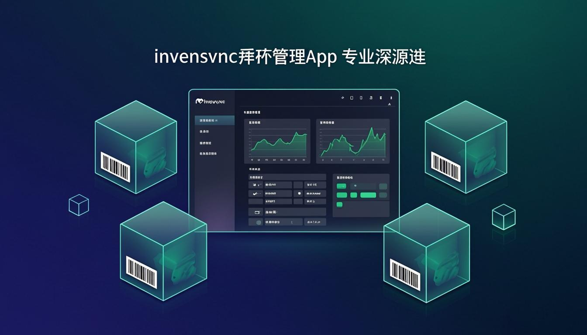

<div align="center">



# InvenSync

**Smart Inventory Management for Ethiopian Retailers**

[](https://nextjs.org/)
[](https://www.typescriptlang.org/)
[](https://www.prisma.io/)
[](LICENSE)

[Features](#-features) • [Tech Stack](#-tech-stack) • [Getting Started](#-getting-started) • [Architecture](#-architecture) • [Screenshots](#-screenshots)

</div>

---

## Overview

InvenSync is a **production-ready inventory management platform** built for Ethiopian retailers and small businesses. It supports 10 industry types with auto-configured product types, attributes, and smart features like AI-powered forecasting and barcode generation.

## Features

### Core Inventory
- **Multi-Shop Support** — Manage multiple stores from a single dashboard
- **Dynamic Product Types** — Create custom product categories with custom attributes
- **Industry Templates** — 10 pre-built business templates (Shoe Store, Restaurant, Pharmacy, etc.)
- **Auto-Generated SKUs** — Smart SKU generation based on product type
- **Barcode Generation** — Generate and scan product barcodes
- **Bulk Import** — CSV-based bulk product import
- **Low Stock Alerts** — Configurable thresholds with real-time notifications

### Sales & Finance
- **Point of Sale** — Quick sale processing with receipt generation
- **Credit & Debt Tracking** — Customer credit limits and debt management
- **Expense Management** — Track business expenses by category
- **Profit & Loss Reports** — Real-time financial analytics

### AI-Powered
- **Sales Forecasting** — ML-based demand prediction
- **Price Optimization** — AI-suggested pricing strategies
- **Anomaly Detection** — Unusual stock movement alerts
- **Business Assistant** — AI chatbot for inventory queries

### Multi-Tenant & Auth
- **Organization-Based Access** — Multi-tenant with role-based permissions
- **Supabase Auth** — Secure authentication with 2FA support
- **Sales Rep System** — Referral tracking and commission management
- **Real-Time Notifications** — WebSocket-powered live updates

### Modular Architecture
- **Plugin System** — Enable/disable features as needed
- **Subscription Plans** — Tiered pricing with free trials
- **Telegram & WhatsApp Integration** — Business messaging connectors

## Tech Stack

| Category | Technology |
|----------|-----------|
| **Framework** | Next.js 16 (App Router) |
| **Language** | TypeScript 5 |
| **Database** | PostgreSQL (Supabase) / SQLite |
| **ORM** | Prisma |
| **Auth** | Custom JWT + Supabase Auth |
| **UI** | shadcn/ui + Tailwind CSS 4 |
| **State** | Zustand + TanStack Query |
| **Real-time** | Socket.IO |
| **Deployment** | Vercel |
| **AI** | OpenAI API (forecasting, assistant) |

## Getting Started

### Prerequisites

- Node.js 18+ or Bun
- PostgreSQL (or SQLite for local dev)
- Supabase account (for auth)

### Installation

```bash
# Clone the repository
git clone https://github.com/L3von36/InvenSync.git
cd InvenSync

# Install dependencies
bun install

# Set up environment variables
cp .env.example .env
# Edit .env with your database URL and Supabase credentials

# Push database schema
bun run db:push

# Start development server
bun run dev
```

Open [http://localhost:3000](http://localhost:3000) in your browser.

### Environment Variables

```env
DATABASE_URL="postgresql://..."     # PostgreSQL for production
DIRECT_URL="postgresql://..."       # Supabase direct connection
JWT_SECRET="your-jwt-secret"
NEXT_PUBLIC_SUPABASE_URL="..."
NEXT_PUBLIC_SUPABASE_ANON_KEY="..."
```

## Architecture

```
src/
├── app/
│   ├── api/                    # 80+ API routes
│   │   ├── auth/               # Authentication endpoints
│   │   ├── products/           # Product CRUD + barcode
│   │   ├── sales/              # POS and receipts
│   │   ├── ai/                 # AI forecasting & assistant
│   │   └── admin/              # Admin dashboard APIs
│   └── page.tsx                # Main SPA entry
├── components/
│   ├── app/                    # Business components
│   │   ├── auth/               # Login, Register, 2FA
│   │   ├── products/           # Product management UI
│   │   ├── sales/              # POS interface
│   │   ├── dashboard/          # Analytics dashboard
│   │   └── settings/           # Organization settings
│   ├── ui/                     # shadcn/ui components
│   └── shared/                 # Reusable form fields, errors
├── lib/
│   ├── business-templates.ts   # 10 industry templates
│   ├── seed-business-template.ts
│   ├── auth.ts                 # JWT utilities
│   ├── auth-fetch.ts           # Authenticated fetch helper
│   ├── api-client.ts           # Centralized API client
│   └── db.ts                   # Prisma client
└── prisma/
    └── schema.prisma           # 30+ models
```

## Business Templates

When registering, users select a business type and InvenSync auto-configures:

| Business Type | Product Types | Key Attributes |
|--------------|---------------|----------------|
| Shoe Store | Sneakers, Formal, Boots, Sandals... | Size, Color, Material, Brand |
| Clothing Store | Shirts, Pants, Dresses, Jackets... | Size, Color, Fabric, Brand |
| Mobile Phone Shop | Smartphones, Feature Phones, Accessories... | Storage, RAM, Color |
| Grocery / Mini Market | Beverages, Snacks, Dairy, Produce... | Unit, Expiry, Category |
| Cosmetics Shop | Skincare, Makeup, Haircare, Fragrances... | Shade, Volume, Brand |
| Hardware Store | Tools, Plumbing, Electrical, Paint... | Size, Material, Grade |
| Restaurant / Cafe | Beverages, Main Course, Desserts... | Portion, Cuisine, Spice Level |
| Electronics Store | TVs, Laptops, Audio, Cameras... | Screen Size, Storage, Brand |
| Pharmacy | Medications, Supplements, First Aid... | Dosage, Generic Name, Category |
| General Retail | Household, Stationery, Health & Beauty... | Category, Material, Size |

All templates are **fully customizable** — edit, add, or remove types and attributes anytime.

## API Highlights

| Endpoint | Method | Description |
|----------|--------|-------------|
| `/api/auth/register` | POST | Register with business type auto-seeding |
| `/api/products` | GET/POST | Products with auto-SKU generation |
| `/api/sales` | GET/POST | POS with receipt/invoice generation |
| `/api/ai/sales-forecast` | POST | AI-powered demand prediction |
| `/api/inventory` | GET | Stock levels with low-stock alerts |
| `/api/notifications` | GET | Real-time notification polling |

## Scripts

```bash
bun run dev          # Start development server
bun run build        # Production build
bun run lint         # ESLint check
bun run db:push      # Push Prisma schema changes
bun run db:generate  # Generate Prisma client
bun run vercel-build # Smart build (auto-detects DB provider)
```

## License

This project is licensed under the MIT License — see the [LICENSE](LICENSE) file for details.

---

<div align="center">

Built with ❤️ by [L3von36](https://github.com/L3von36)

</div>
